# bc_ad_lab
BeCode Module - Active Directory Pentesting

# Intro

A lab was set up with one machine running a Windows Server with an Active Directory.
Two other Windows 10 user computers were set up to simulate a working environment.
A machine running a Debian Server was also set up.

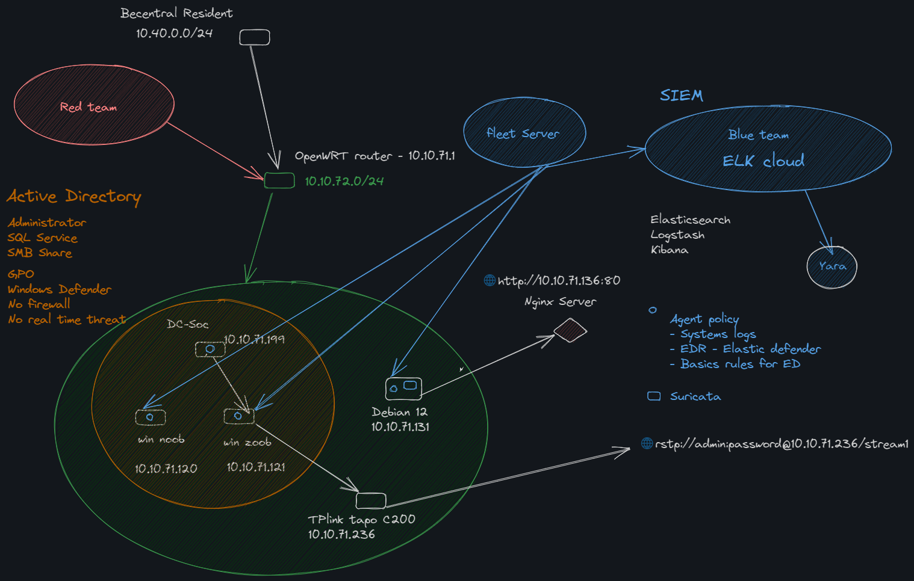

# Goal

We assumed the role of the Red Team and were tasked with gaining access to a Domain Admin account.

# Steps

## 1. Infiltrating the Network

We observe the network "ADSOC" where our target operates.

The first step is to gain access to the wifi network and start operating from within.

We used the alfa awus036acs. 

We're going perform a deauth attack that'll let us capture a 4 way handshake. For that we'll use a tool that handles everything but alternatives would be to use airmon-ng, airreplay-ng and airodump-ng.

This tool is called Wifite, which lets us easily capture handshake and perform many other WiFi attacks beside deauth, such as Pin code, WPS attack, PMKID attack, etc...

So first when launching wifite, we select the available interface, that is our ALFa usb.

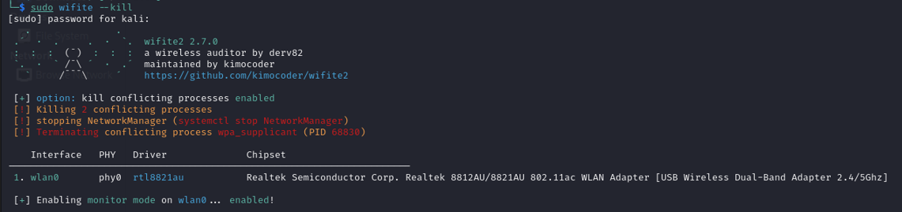

With airmon-ng we would have typed every command ourselves but here, we can see that the script does everything by itself, we just need to select which Access point we want to attack.

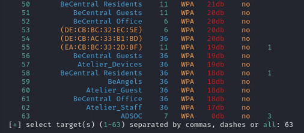

Wifite will then try to find every device connected to this AP and start a deauth attack on all of them.

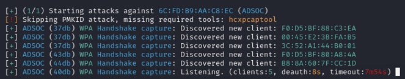

Once we have the handshake, wifite will try to crack the hash with some default common password, if it fails we need to convert the hash to be able to use it with hashcat with the following comand:

>hcxpcapngtool -o ADSOC-converted.hc22000 -E wordlist ADSOC.cap

Here we use hashcat on windows so that it can use the GPU and be faster:

>.\hashcat.exe -m 22000 .\ADSOC-converted.hc22000 -a 0 --kernel-accel=1 -w4 --force .\rockyou.txt

Once that's done, we have the necessary credentials to connect to the network and start enumerating it.

## 1a. Enumerating the Network

Once connected to the network, we can run several commands to find an attack surface and start exploiting it. We can also figure out the Domain name, in this case BECODE.local.

> sudo netdiscover -r 10.10.71.0/24

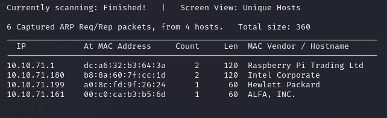

> nmap -Pn 10.10.71.199

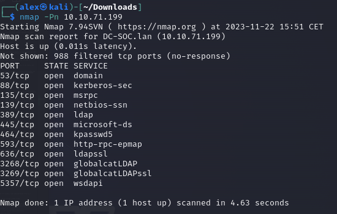

> rpcclient -U "" -N 10.10.71.199

> lsaquery

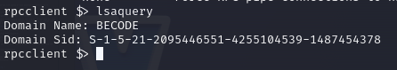

## 2. LLMNR Poisoning

### What is LLMNR ?

LLMNR, or previously called NBT-NS, is used to identify hosts when the DNS fails to do so and it's main flaw is that it uses a user's username and NTLMv2 when responded to in the right manner.

### How does it work ?

When a user tries to connect to an address on the network that doesnt exist, i.e. mistyping the address of a remote share, the DNS fails to identify the address thus the LLMNR takes over and asks the machines on the network if the address belongs to them. Responder will respond to that request with a poisoned response and thus retrieve the NTLMv2 hash.

### Action

As soon as we get on the network, the first thing we do is run Responder to poison LLMNR requests and potentially capture a NTLMv2 hash.

> responder -I eth0 -dwv

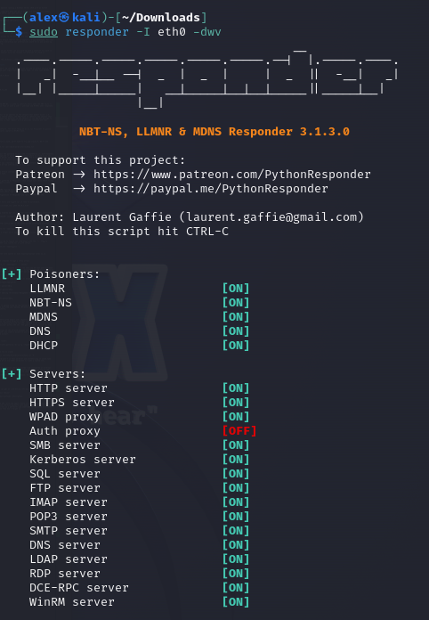
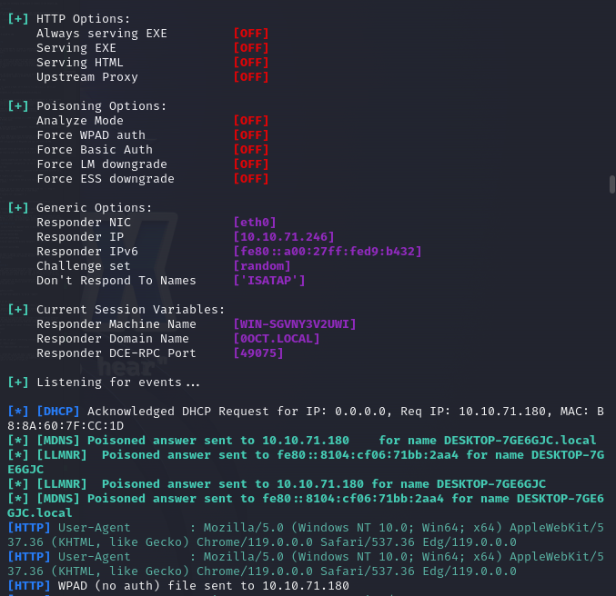
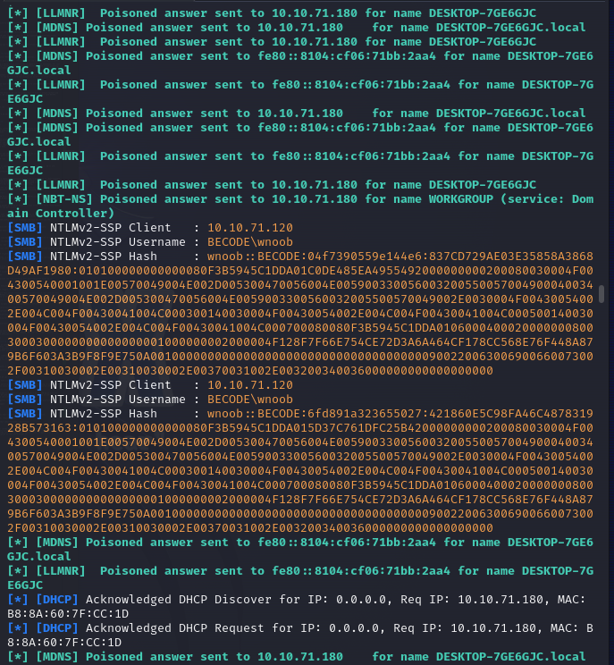

Once we've managed to capture a hash, we'll have to try and crack it. We'll use hashcat again to do so.

> hashcat -m 5600 ntlmhash.txt /usr/share/wordlists/rockyou.txt

This wordlist didn't contain the password so we tried to bruteforce it. Unfortunately the password was long enough and it would require hashcat years to crack it on our machines. We even rented a server on DataCrunch equipped with 8 high-end GPUs to give it a more serious try but it was still taking too long.

In the end what worked out was creating a custom wordlist containing different ways of writing an old password we had used during our training.

## 2a. SMB Relay Attack

We can perform a SMB Relay Attack instead of a LLMNR Poisoning attack if we do not manage to crack the NTLMv2 hash.

### What is SMB Relay ?

Instead of cracking hashes gathered by Responder, this attack will relay those hashes to specific machines and gain access. 

### Requirements

For this attack to work, SMB Signing must be disabled on the target machine and the relayed credentials must have admin rights on the machine.

### Action

First, we need to discover hosts and figure out if they're vulnerable.

> nmap --script=smb2-security-mode.nse -p445 10.10.71.0/24

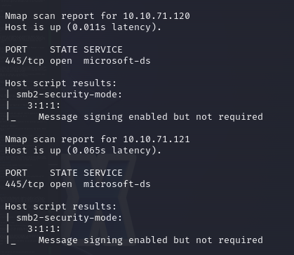

If we see "Message signing enabled but not required" then the machine is vulnerable.

We need to change Responder's configuration and turn Off HTML and SMB. After that we run it with the usual command.

> responder -I wlan1 -dwv

Then we run ntlmrelayx (After putting the ip addresses of the vulnerable machines in a file targets.txt).

> ntlmrelayx.py -tf targets.txt -smb2support

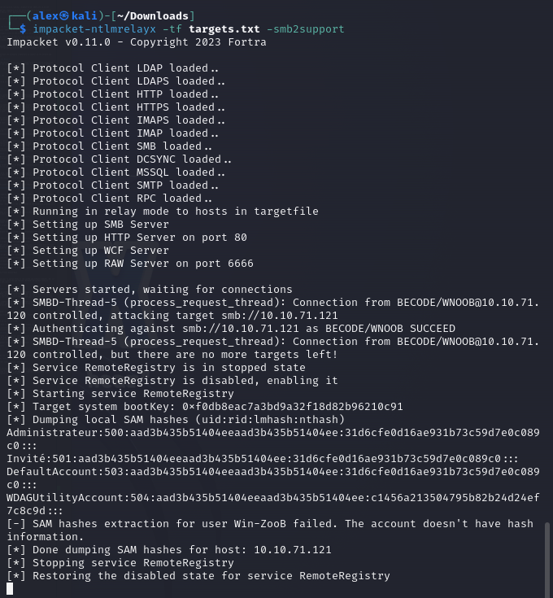

If the attack succeeds on a target we'll end up with the machine's SAM hashes. Those are linked to local users.

Another way of attacking can be to launch our ntlmrelayx with the `-i` flag to straight up pop a samba shell and listen for it with netcat.

> ntlmrelayx.py -tf targets.txt -smb2support -i

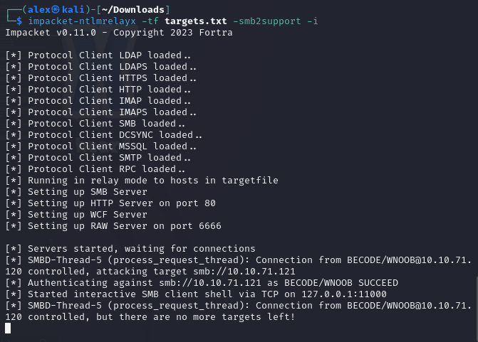

> nc 127.0.0.1 11000

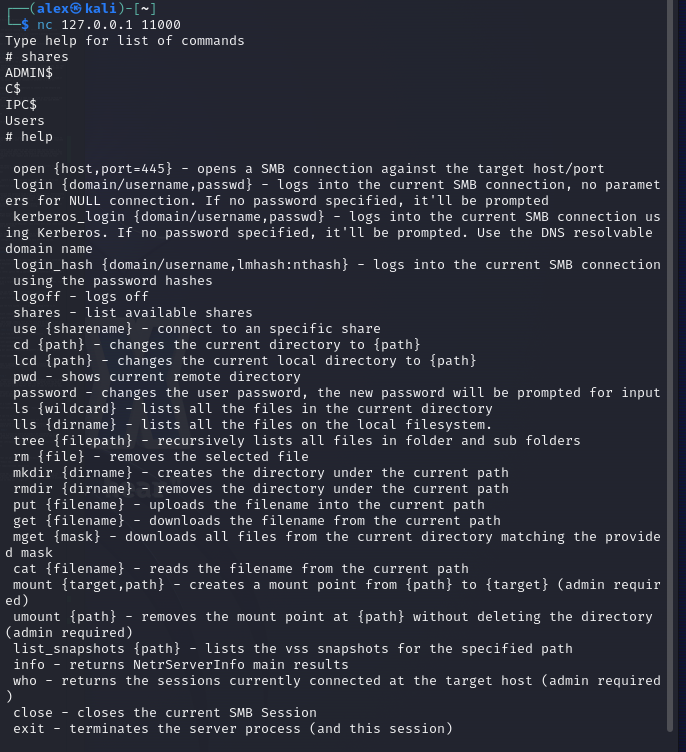

This allows us to browse the file system or even download/upload files on it.

We can also try to execute commands through a relay attack.

> ntlmrelayx.py -tf targets.txt -smb2support -c "whoami"

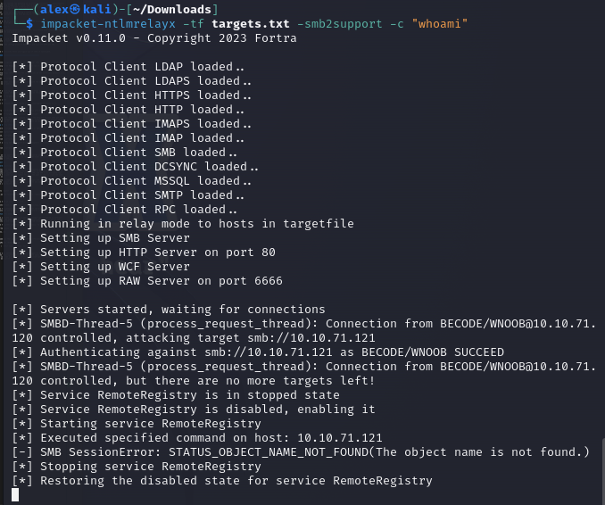

We managed to execute this whoami command once at the very end of last week but when we tried again on Monday it wasn't working anymore. Actually a lot of attacks relying on samba were giving us an error. We suspect that Elastik Security was blocking them.

## 2b. Gaining strong shell access

We tried different scripts from the impacket-tools or msfconsole.

> msfconsole ==> exploit/windows/smb/psexec

> psexec.py lab.local/user:password@ip

> smbexec.py lab.local/user:password@ip

Those were not working but abusing the Windows Management Instrumentation did the trick:

> wmiexec.py lab.local/user:password@ip

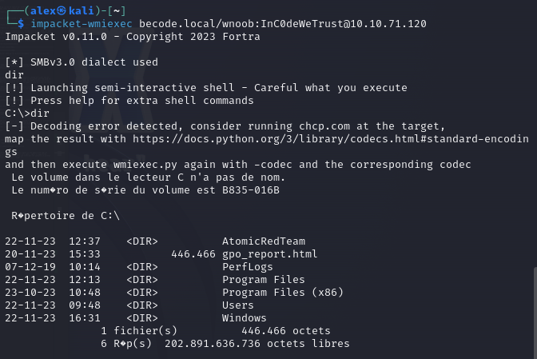

At this point we had ways to upload files on the system and execute commands. But our payload was systematically detected and removed. Moreover we couldn't execute powershell commands efficiently.

## 3. Kerberoasting

### What is Kerberoasting ?

In such an attack, an authenticated domain user requests a Kerberos ticket for an Service Principal Name. The retrieved Kerberos ticket is encrypted with the hash of the service account password affiliated with the SPN. (An SPN is an attribute that ties a service to a user account within the AD). The goal is then to crack the hash obtained that way.

Once the plaintext credentials of the service account are obtained, we can impersonate the account owner and inherit access to any systems, assets or networks granted to the compromised account.

### Action

We first try to request a ticket:

> GetUserSPNs.py lab.local/user:password -dc-ip ip -request

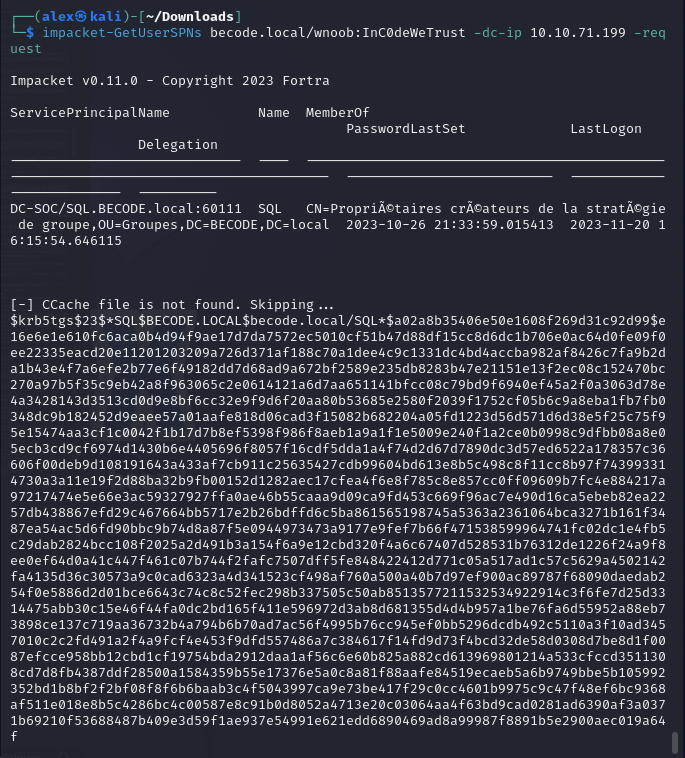

This gets us a hash we can try to crack:

> hashcat -m 13100 hash.txt /usr/share/wordlists/rockyou.txt -O

But once again the password wasn't in this wordlist and bruteforcing it would take too long. A solution would be to try other wordlists or craft a custom one.

## 4. Enumerating the domain

That's when we switched to a situation where we wouldn't be considered as external attackers anymore. We used the domain user and password discovered on one of the windows 10 machines and simulate pentesting from the inside.

Here we wanted to gather information about the domain. So we used powerview!

> powershell -ep bypass

> . .\PowerView.ps1

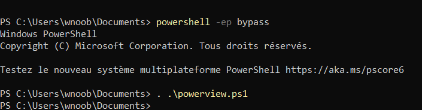

Amongst the commands that can get us interesting information we have:

> Get-NetGroupMember "Domain Admins"

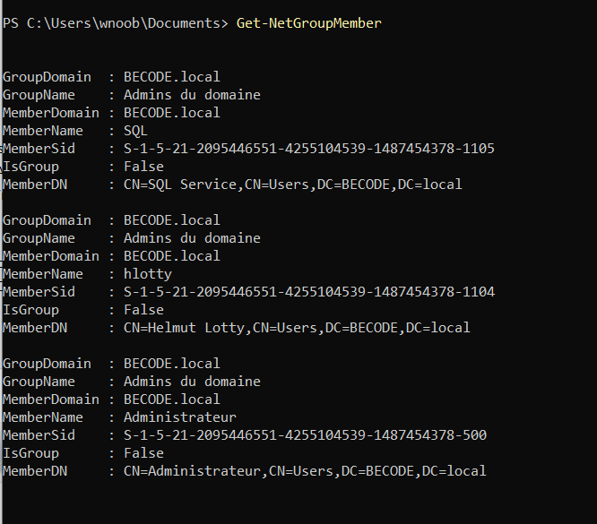

> Get-NetUser | select samaccountname, description

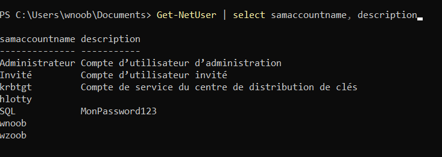

We could see a user called SQL, wich had admin rights on the domain and had its password in the desscription. Service accounts with admin rights is apparently something you can come accross as a pentester and sometimes the password is written down in their desciption so they don't forget it. 

